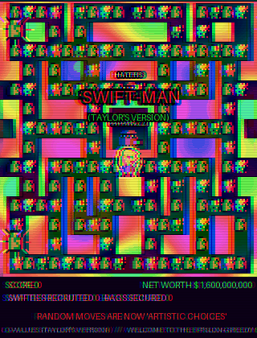
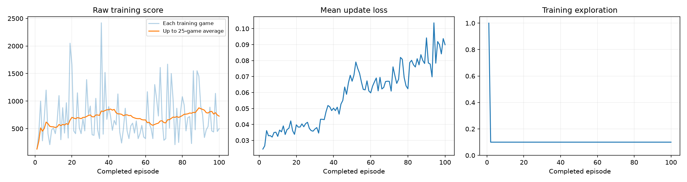
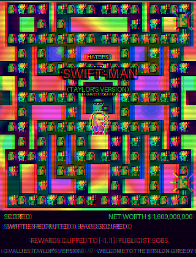
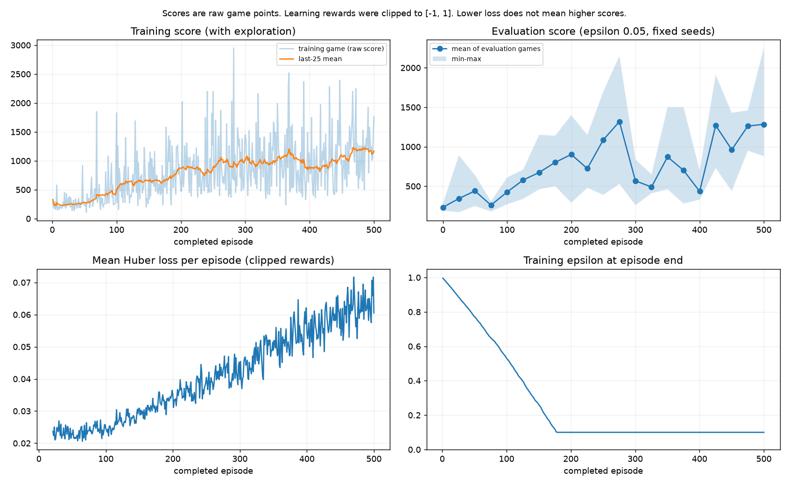
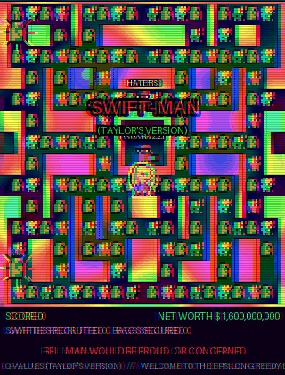

# SWIFT-MAN (Taylor's Version)

### A Deep Q-Network learns Ms. Pac-Man, and the footage is repainted as a psychedelic 8-bit Taylor Swift fever dream

[](https://colab.research.google.com/github/ebright09/swift-man-dqn-class3/blob/main/pacman_dqn.ipynb)



**The real part:** a reinforcement-learning agent (DQN) that learns to play Atari Ms. Pac-Man from raw pixels.
**The unhinged part:** every recorded clip replaces Ms. Pac-Man with a Mario/Luigi-style 8-bit Taylor Swift. The pellets become tiny Swifties and bags of money, and the ghosts become HATERS, PAPARAZZI, TICKET BOTS, and CRITICS. All of it plays on a rainbow plasma maze with CRT glitches, screen shake, and a fake net-worth counter.

> **Parody disclaimer:** this is a fan-made classroom joke. It is not affiliated with, endorsed by, or known to Taylor Swift, her team, her label, or Atari. No Swifties were harmed. They were *recruited*.

**Phase Two** ([jump to it](#phase-two-the-same-dqn-as-a-resumable-command-line-project)) rebuilds the same DQN as resumable Python modules, with a decaying epsilon, and trains it for 500 episodes: the mean evaluation score went from **232 → 1,284**, with a mid-run slump shown in full.

Fundamentals of AI, Fall 2026, Class 3. Built on the course's original notebook ([pepealonso95/pacman-dqn](https://github.com/pepealonso95/pacman-dqn)).

---

## The one fact that matters: the glitter is cosmetic

| | The neural network sees | You see |
|---|---|---|
| Hero | a gray smudge | 8-bit Taylor: bangs, cat-eye liner, red lip, mic, sequins, pink boots, walk cycle, rainbow trail |
| Pellets | small gray smudges | tiny Swifties with friendship bracelets, and money bags |
| Power pellets | slightly bigger smudges | giant money bags with spinning rainbow rays |
| Ghosts | darker smudges | HATERS / PAPARAZZI / TICKET BOTS / CRITICS, in sunglasses, firing camera flashes |
| Maze | 84 × 84 grayscale | rainbow plasma with chromatic aberration, torn scanlines, and random color inversion |

The makeover (`SwiftSkin` in section 3½ of the notebook) only runs on frames saved to GIFs, after each move has already been chosen from the plain game screen. **Training is unchanged.** A 5-episode run with the same seed produced exactly the same decisions, learning updates, training scores, and before/after scores as the original notebook.

Set `SWIFT_MODE = False` in the notebook to get the original beige Atari footage back.

## How to run it

Open **[pacman_dqn.ipynb](pacman_dqn.ipynb)**, choose three numbers in section 1, and Run All.

| Choice | What it controls | Course starting point | This run |
|---|---|---|---|
| Exploration | Fraction of random training moves after warm-up | `0.20` | `0.10` |
| Episodes | Number of training games | `100` | `100` |
| Learning rate | Size of each learning update | `0.0001` | `0.00025` |

**Colab:** click the badge above, choose Runtime → Change runtime type → T4 GPU, then Runtime → Run all.

**Local (Mac/Linux):**

```sh
python3 -m venv .venv
source .venv/bin/activate
python -m pip install -r requirements.txt
python -m jupyter lab pacman_dqn.ipynb
```

Try 5 episodes first as a quick check. On an M1 MacBook Pro, 5 episodes take under a minute and 100 episodes take about 9 minutes (Apple MPS).

## Results

100 episodes, 10% exploration, learning rate 0.00025, on an M1 MacBook Pro (MPS): 60,743 decisions, 14,936 learning updates, 8.6 minutes.

| Evaluation game (seed) | Before training | After 100 games |
|---|---|---|
| 101 | 350 | 1,210 |
| 202 | 500 | 700 |
| 303 | 320 | 720 |
| 404 | 800 | 1,280 |
| 505 | 490 | 430 |
| **Mean** | **492** | **868 (+376)** |



| Before training (debut era) | After 100 games |
|---|---|
|  |  |

What the numbers do and don't say:
- Four of the five evaluation games improved and one got slightly worse. Five games is a small sample.
- The training-game average barely moved (roughly 680 → 730 per 25-game block). That's partly because 10% of training moves are random, and partly because 100 games is tiny by Atari standards: the original DQN paper trained for about 50 million frames, and this run used about 240,000.
- The loss *rose* over training. That's normal for DQN: as the network starts predicting bigger future rewards, its targets grow and move, so the error isn't a scoreboard.
- Checkpoints (`.pt`) aren't committed (about 7 MB each); rerun the notebook to regenerate them.

## How the DQN works (no glitter)

- **Environment:** `ALE/MsPacman-v5`. Four emulator frames per decision, sticky actions (25%), up to 30 no-op starts, and a 3,000-decision cap per game.
- **Observation:** four stacked 84 × 84 grayscale frames, so the network can tell which way things are moving.
- **Network:** three convolution layers plus two fully connected layers, outputting one **Q-value** (expected future points) per joystick move.
- **Exploration:** epsilon-greedy. 1,000 random warm-up decisions, then a constant epsilon (10% here).
- **Learning:** experience replay (5,000 transitions), batches of 32 every 4 decisions, a target network synced every 1,000 decisions, gamma 0.99, Huber loss, and Adam. Training rewards are clipped to [-1, 1]; every reported score is the raw game score.
- **Evaluation:** the same five seeds before and after training, with 5% exploration, on a separate environment that never touches replay memory or weights.

## How the makeover works

- **Finding things:** OpenCV connected components on the full-color Atari frame. Small wall-colored blobs are pellets, taller ones are power pellets, the yellow blob is Ms. Pac-Man, and 8 × 10 blobs in ghost colors are ghosts.
- **Sprites:** hand-written text maps, one letter per pixel, drawn as 2 × 2 blocks. That's how NES sprites were made. Taylor is a 14 × 18 side-view sprite with two walk/chomp frames. She flips to face the way she's moving and gets a glowing halo so you can find her.
- **Chaos:** an HSV plasma recomputed every frame, a neon maze with outlines, RGB channel offsets, glitch slices every ninth frame, color inversion every 29th, shake on ghost eats, a strobe on power pellets, and CRT scanlines.
- **HUD:** score, a "net worth" of $1.6B plus $1M per point (a bit), Swifties recruited, bags secured, a rotating RL-themed caption, and a scrolling ticker.
- **Cost:** about 40 ms per frame, only on the ~75 frames per clip. Each GIF is about 4.6 MB because rainbow plasma compresses terribly.

## Phase Two: the same DQN as a resumable command-line project

Phase one (the notebook) is the classroom version, with a constant epsilon and fixed settings. Phase two follows the course's "build an agent from scratch with AI" prompt: separate Python modules, a decaying epsilon, a RAM-sized replay memory, honest resume, and a three-way comparison. The game, the SWIFT-MAN skin, and every theme are unchanged. `phase_two/swift_skin.py` is a byte-for-byte copy of the notebook cells, and a test fails if they drift apart.

### Tested setup

macOS 26.6.2 on an Apple M1 MacBook Pro (16 GB RAM), Python 3.13.1, torch 2.14.0 (MPS), gymnasium 1.3.0, ale-py 0.11.2, numpy 2.5.3, opencv-python-headless 4.14.0.94, Pillow 12.3.0, matplotlib 3.11.2, and pytest 9.1.1 for tests. ale-py 0.12.1 exists but wasn't adopted, because a newer emulator could change how the game plays. The Atari ROM ships inside `ale-py` (per the [ALE install guide](https://ale.farama.org/getting-started/)), so no AutoROM step is needed. `gym.register_envs(ale_py)` registers `ALE/MsPacman-v5`.

Setup is the same `requirements.txt` as phase one. Windows: activate with `.venv\Scripts\Activate.ps1`. Linux without a display: add `--no-live-window` (GIFs are still saved). CUDA is picked automatically if present.

### Commands (run from the repo root)

| What | Command |
|---|---|
| Smoke test (about 20 s, every code path) | `python -m phase_two.train --smoke` |
| Full training (500 episodes) | `python -m phase_two.train` |
| Stop early | Ctrl+C. It saves `checkpoints/latest.pt`, the logs, and the plot, then prints the resume command |
| Resume | `python -m phase_two.train --resume runs/<run>/checkpoints/latest.pt` (add `--episodes 800` to extend) |
| Compare policies | `python -m phase_two.play --checkpoint runs/<run>/checkpoints/final.pt` |
| Re-draw the dashboard | `python -m phase_two.plot runs/<run>` |
| Check the device | `python -m phase_two.device` |
| Unit tests | `python -m pytest tests/test_phase_two.py` |

Every setting in `phase_two/config.py` is also a flag, e.g. `--learning-rate 2.5e-4 --replay-gb 1.5 --no-live-window`.

### The files

| File | Job |
|---|---|
| `device.py` | Prints OS/Python/torch, tries CUDA → MPS → CPU with one real training batch each, and reports any fallback |
| `model.py` | The CNN: 3 conv layers + 2 linear layers, 3136 → 512 → n_actions. Outputs are Q-values (expected future reward), not probabilities |
| `preprocess.py` | One frame-skip mechanism, 84×84 grayscale, 4-frame stack, uint8, and the time limit (settings table below) |
| `replay_buffer.py` | Stores each frame once in a ring and rebuilds stacks when sampling; sized from a memory budget after printing the estimate |
| `agent.py` | Epsilon-greedy, online and target networks, Bellman targets, Huber loss, Adam |
| `train.py` | Preflight checks, the training loop, evaluation demos, checkpoints, Ctrl+C handling, resume |
| `play.py` | Random actions vs. untrained network vs. trained network on the same 5 seeds, plus `final_best.gif` |
| `plot.py` | `training_dashboard.png`, with training and evaluation scores in separate panels |
| `config.py` | Every number, with its unit |
| `live_window.py` | Shows evaluation demos live in a separate process; falls back to GIF-only |

### Observation, actions, reward, objective

- **Observation (state):** the last 4 screens, each grayscale and resized to 84×84, stored as uint8 (0–255) and scaled to 0–1 on the device. Four frames let the network see motion.
- **Actions:** 9, read from the environment: NOOP, UP, RIGHT, LEFT, DOWN, UPRIGHT, UPLEFT, DOWNRIGHT, DOWNLEFT.
- **Reward:** the game's points for that step (pellet 10, power pellet 50, ghosts 200–1600, fruit). For learning, rewards are clipped to [-1, 1]. Every score reported anywhere is the raw game score.
- **Objective:** make Q(s, a) match `r + γ · max_a' Q_target(s', a')` with γ = 0.99. The future term is dropped only on a true game over (`terminated`). A game cut off by the 3,000-step limit (`truncated`) keeps it, because the game could have continued. Targets are detached, and the loss is Huber.

### Preprocessing and wrapper settings

| Setting | Value | Why |
|---|---|---|
| Base env | `ALE/MsPacman-v5`, `frameskip=1` | so that only one wrapper skips frames |
| `AtariPreprocessing` | `frame_skip=4`, `noop_max=30`, `screen_size=84`, grayscale, `scale_obs=False`, `terminal_on_life_loss=False` | 4 frames per decision (max-pooled to remove flicker), random start, uint8 kept |
| Sticky actions | `repeat_action_probability=0.25` (v5 default) | the environment is slightly unpredictable, as intended by ALE v5 |
| `FrameStackObservation` | 4 frames, `padding_type="reset"` | after reset the stack is 4 copies of the new first frame, so games never mix |
| `TimeLimit` | 3,000 decisions (about 200 s of play) | reported as truncation, not game over |

Combining v5's default `frameskip=4` with the wrapper's would skip 16 frames per decision. Gymnasium 1.3 refuses that combination with a `ValueError`.

### Schedules and their units

A **step** is one agent decision (4 emulator frames), counted across all episodes.

| Schedule | Default | Unit |
|---|---|---|
| Epsilon | 1.0 → 0.1, linear | over 100,000 steps, then flat |
| Warm-up before learning | 10,000 | steps collected with no updates |
| Learning | one batch of 32 | every 4 steps |
| Target network sync | copy online → target | every 10,000 steps |
| Evaluation demo | 5 fixed seeds, epsilon 0.05, GIF of the first | every 25 episodes |
| Numbered checkpoint | `episode_0100.pt`, ... | every 100 episodes |
| GIF | 300 steps recorded, every 4th kept → at most 75 frames at 67 ms | per demo (about 5 s, 4× speed) |

### Replay memory and RAM

Storing obs and next_obs as full stacks costs 56,448 bytes per transition. Phase two stores each 84×84 frame once (7,071 bytes per transition including bookkeeping) and rebuilds both stacks by index, never reaching back past the start of a game. The budget (`--replay-gb`, 0 = auto: 40% of currently free RAM, capped at 2 GiB) is converted to a capacity and printed before allocation. On this run, about 2.4 GiB of RAM was free, so the auto budget was 0.97 GiB = **147,295 transitions**. Full stacks would have fit only 18,451. The run made 322,790 steps, so the ring wrapped around about twice.

### Resume: what's saved and what isn't

Checkpoints save the online and target networks, the Adam optimizer state, the step/update/episode counters (so epsilon resumes exactly where it was), elapsed time, and the RNG states for exploration, replay sampling, torch, and Python. **Replay memory is not saved** (it's gigabytes). A resumed run refills `warmup_steps` of experience before learning again, and says so when it starts. A resumed run always starts at a new game, since an Atari game can't be restored mid-way. If Ctrl+C lands during an evaluation, the resume re-runs that evaluation. Results after a resume are therefore close to, but not bit-identical with, an uninterrupted run.

### Phase Two results

**Hardware and budget:** Apple M1 (MPS), 500 episodes, **322,790 environment steps** (about 1.3 million emulator frames), **78,198 learning updates**, **47.4 minutes** wall-clock time (training plus 21 evaluation demos and GIFs). All other settings were defaults.

**Final comparison** (`python -m phase_two.play`: same 5 seeds, evaluation epsilon 0.05, 3,000-step cap for every policy):

| Seed | Random actions | Untrained network | Trained (episode 500) |
|---|---|---|---|
| 101 | 190 | 190 | 1,130 |
| 202 | 250 | 280 | 2,250 |
| 303 | 140 | 190 | 880 |
| 404 | 280 | 260 | 1,010 |
| 505 | 320 | 240 | 1,150 |
| **Mean** | **236** | **232** | **1,284** |

All five games improved; the trained agent averages about 5.5× the untrained network. The random-action and untrained-network baselines are labeled separately. They score about the same, because an untrained network mostly repeats one move.



| Untrained (episode 0) | Episode 200 | Episode 400 (slump) | Best final game (2,250) |
|---|---|---|---|
|  |  |  |  |

**The progress was not smooth.** Evaluation means every 25 episodes (5 games each):

| Episode | 0 | 50 | 100 | 150 | 200 | 250 | **275** | 300 | 325 | 350 | 375 | **400** | 425 | 450 | 475 | 500 |
|---|---|---|---|---|---|---|---|---|---|---|---|---|---|---|---|---|
| Eval mean | 232 | 440 | 426 | 674 | 902 | 1,088 | **1,318** | 568 | 490 | 872 | 700 | **434** | 1,270 | 962 | 1,262 | 1,284 |

Evaluation climbed steadily to 1,318 at episode 275, fell to 434 by episode 400, then recovered. The saved checkpoints tell the same story when re-evaluated (`checkpoint_comparison.json`): episode 100 → 426, 200 → 902, 300 → 568, 400 → 434, 500 → 1,284. The numbers exactly match the in-training evaluations, so evaluation is deterministic.

What the numbers do and don't say:
- The training-game average (with 10% random moves) rose from about 250 to about 1,170 and dipped less than evaluation did. Evaluation games are few (5) and sensitive to a single bad habit.
- The mid-run slump started around when the replay memory filled and began overwriting old experience (about step 147,000). Plain DQN is known for this kind of instability. This run doesn't prove the cause.
- The loss rose throughout. That's expected: as the agent survives longer and predicts bigger returns, the targets grow. Loss is not a score.
- Five evaluation games per checkpoint is a small sample, and one run with one seed can't separate luck from settings.
- This is about 1/40 of the original DQN paper's training budget (50 million frames). It says nothing about how far this agent would get with more training.

**One limitation, and what could be tried next** (for Evan's own write-up): the final checkpoint happened to be good, but the agent was at its worst 100 episodes earlier, and the episode-275 peak had no saved checkpoint because only every 100th episode is saved. Candidate fixes to test one at a time: save the best checkpoint by evaluation score, use Double DQN targets, lower the learning rate, or use a larger replay budget when more RAM is free.

## What's in this repo

| Path | What it is |
|---|---|
| `pacman_dqn.ipynb` | The whole project, self-contained (Colab-ready), with no saved outputs |
| `results/` | Phase one evidence (100-episode notebook run): GIFs, dashboard, scores, config, training log |
| `results/phase_two/` | Phase two evidence (500-episode run): GIFs, dashboard, three-way comparison, checkpoint comparison, logs |
| `phase_two/` | Phase two: the DQN as resumable command-line modules (see above) |
| `pacman_player.py` | Optional local popup GIF player |
| `tests/verify_notebook.py` | Runs every notebook cell in order with 5 episodes and checks every artifact |
| `tests/test_phase_two.py` | Phase two unit and end-to-end tests (pytest) |
| `requirements.txt` | Local dependencies |

Run the test with `python tests/verify_notebook.py --kernel <your-kernel> --no-popups`.

## Built with AI

This project was built with **Claude Code** (Anthropic) at my direction, starting from the instructor's DQN notebook. Claude Code wrote the SWIFT-MAN makeover, rewrote the notebook text, built phase two, ran both training runs, and drafted this README. I chose phase one's three hyperparameters; phase two uses the defaults from the course prompt. The reflection in the notebook is mine to write.

Review log:
1. Built the pixel-art sprites and reviewed a rendered sprite sheet. Switched to a Mario/Luigi-style 8-bit Taylor at my request.
2. Rendered real game frames and fixed ghosts being painted over by the plasma.
3. Ran `tests/verify_notebook.py` end to end: PASS. Confirmed the 5-episode training and evaluation numbers match the original notebook exactly.
4. Fixed a ticker glyph the default font can't draw, and added a halo so Taylor stays visible.
5. Ran the full 100-episode experiment and copied the evidence into `results/`.
6. Phase two, built from the course's build-from-scratch prompt: wrote the modules, and fixed a CSV parsing bug in the plot plus a preflight index bug found by the smoke run.
7. Replaced the planned 5-frames-per-transition replay with true single-frame storage after checking the RAM math, and added auto-sizing because only about 3 GB of RAM was free.
8. Tested Ctrl+C save and resume for real. Made resume re-run an evaluation that an interrupt cut short.
9. Ran `tests/test_phase_two.py`: 6 passed. Ran the 500-episode experiment (after one aborted start), the three-way comparison, and a re-evaluation of every saved checkpoint.

## Sources

- [ALE installation](https://ale.farama.org/getting-started/)
- [Gymnasium Atari preprocessing](https://gymnasium.farama.org/api/wrappers/misc_wrappers/#gymnasium.wrappers.AtariPreprocessing)
- [Gymnasium frame stacking](https://gymnasium.farama.org/api/wrappers/observation_wrappers/#gymnasium.wrappers.FrameStackObservation)
- [DQN paper: Human-level control through deep reinforcement learning](https://storage.googleapis.com/deepmind-media/dqn/DQNNaturePaper.pdf)
- Original classroom notebook: [pepealonso95/pacman-dqn](https://github.com/pepealonso95/pacman-dqn)
